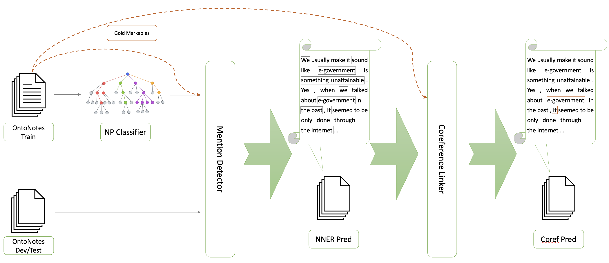
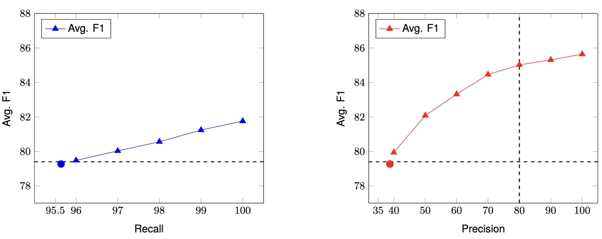

# SPLICE: A Singleton-Enhanced PipeLIne for Coreference REsolution

[**Paper**](https://aclanthology.org/2024.lrec-main.1321.pdf) |
[**Introduction**](#introduction) | [**Data**](#data) | [**Prerequisites**](#prerequisites) | [**Usage**](#usage) |
[**Citation**](#citation) | [**Contact**](#contact)

## Introduction
This repository contains the mention span data and the source code of the paper from:

- [SPLICE: A Singleton-Enhanced PipeLIne for Coreference REsolution](https://aclanthology.org/2024.lrec-main.1321.pdf)
- [Yilun Zhu](http://yilunzhu.com/), [Siyao Peng](https://logan-siyao-peng.github.io/), [Sameer Pradhan](https://cemantix.org/), and [Amir Zeldes](https://corpling.uis.georgetown.edu/amir/)

<br>
In this work, we introduce a novel approach to address the coreference resolution challenge. It establishes a near-gold singleton dataset for OntoNotes, which is shown to be highly accurate. This dataset can benefit further research endeavors involving singletons in coreference systems. Additionally, we propose SPLICE, a pipeline-based neural system that independently trains mention detection and coreference models. Our system achieves comparable in-domain results with the end-to-end approach and demonstrates superior out-of-domain performance. <br><br>

<p align="center">
  <br>
  <em>The Pipeline of SPLICE.</em>
</p>


<br>Leveraging the better interpretability of our system, we conduct a comprehensive analysis of mention predictions. We discover that resolving additional recall errors is more challenging than addressing precision errors, which offers valuable insight for future work in coreference resolution research. <br>

<p align="center">
  <br>
  <em>Analyzing the impact of recall and precision scores on the OntoNotes development set.</em>
</p>

## Data
We create a dataset that includes mention spans from OntoNotes 5.0. These spans are a combination of coreference markable spans (gold) and singleton spans. You can find this span data in the following directory: `./data/ontonotes5_mentions.zip`.

Due to licensing requirements from the Linguistic Data Consortium (LDC), we are only able to release the mention span data of OntoNotes 5.0 in CoNLL format, without *token-level* annotations.

If you possess an LDC license and wish to access the dataset in CoNLL format, thus avoiding the need to process the released data in this repository yourself, please send an email to the corresponding authors (in [**Contact**](#contact)) and include a screenshot of your valid LDC license.

## Prerequisites
1. Python >= 3.6
2. Install Python3 dependencies: pip install -r requirements.txt
3. Download the pretrained SpanBERT weights from [here](https://github.com/facebookresearch/SpanBERT) to `data/spanbert_large`
4. Prepare datasets
    - [OntoNotes 5.0](https://catalog.ldc.upenn.edu/LDC2013T19)
    - [OntoGUM 8.0](https://github.com/amir-zeldes/gum/releases/tag/V8.1.0)
    - [ARRAU 2.0 RST](https://catalog.ldc.upenn.edu/LDC2013T22)

## Usage
### NP Classifier
    src/mention_detector/raw
    ├── ontonotes-release-5.0/data/files/data/english/annotations
    │   ├── bc
    │   └── ...
    ├── on_gold_conll
    │   ├── train/data/english/annotations
    │   │   ├── bc
    │   │   └── ...
    │   ├── development/data/english/annotations
    │   └── test/data/english/annotations
    └── arrau
        ├── train
        │   ├── const
        │   └── dep
        └── test
      
1. Put OntoNotes and ARRAU-RST in `src/mention_detector/raw` according to the directory map above
2. Run `build_data_pipeline.sh` to
    - process raw data
    - train the NP classifier
    - Get mention predicitions of OntoNotes in `src/mention_detector/data/ontonotes_sg`

### Mention Detector
1. Train an NNER system (in the paper we use [sequence-to-set](https://github.com/zqtan1024/sequence-to-set)) for OntoNotes based on a combination of gold markables and spans predicted from the NP classifier
2. Restore NNER preidictions on OntoNotes development and test set to prepare the data for coreference linking
    - Run `src/mention_detector/nner/restore_nner_res.py`

### Coreference Model
Modify based on the implementation from [coref-hoi](https://github.com/lxucs/coref-hoi)

1. Prepare OntoNotes and OntoGUM data
2. Run `run.py [config] [gpu_id]`

## Citation
```
@inproceedings{zhu-etal-2024-splice-singleton,
    title = "{SPLICE}: A Singleton-Enhanced {P}ipe{LI}ne for Coreference {RE}solution",
    author = "Zhu, Yilun  and
      Peng, Siyao  and
      Pradhan, Sameer  and
      Zeldes, Amir",
    editor = "Calzolari, Nicoletta  and
      Kan, Min-Yen  and
      Hoste, Veronique  and
      Lenci, Alessandro  and
      Sakti, Sakriani  and
      Xue, Nianwen",
    booktitle = "Proceedings of the 2024 Joint International Conference on Computational Linguistics, Language Resources and Evaluation (LREC-COLING 2024)",
    month = may,
    year = "2024",
    address = "Torino, Italy",
    publisher = "ELRA and ICCL",
    url = "https://aclanthology.org/2024.lrec-main.1321",
    pages = "15191--15201",
}
```
## Contact
Please contact yz565@georgetown.edu or Amir.Zeldes@georgetown.edu, or raise an issue in this repository.
